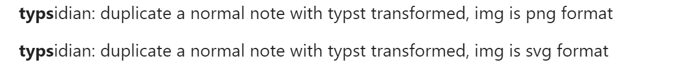

相比上游仓库:
- [x] 更好的 typst 回退到 mathjax.
- [x] 可自行设置 Wasm 获取网址.
- [x] 更新 typst.ts 依赖版本 (on 2025-11-08).

---

Typsidian is a plugin of [Obsidian](https://obsidian.md/), which provides releted functions of [typst](https://typst.app), suchs as correct display of typst code, export non-typst markdown file for other markdown platform.

中文介绍看这里:  <https://zhuanlan.zhihu.com/p/1936210614520361485>

Custom area that
display typst code rather than latex code, and it provides
that(only inline) when typst parsing gets errors, display automatically
return to latex(please enable it in settings).

And when you are focus on a note, open command panel:

run them will duplicate file of active editor with typst code automatically transformed to latex or image(png/svg,
uploaded to github, therefore you should ensure you add
your token and other relevant setting items, otherwise it goes wrong).

Feel free to issue.

#### Usage

Open the setting panel to see what you can do,
you can enable typst rendering in
math block, math inline, and customized lang block.
